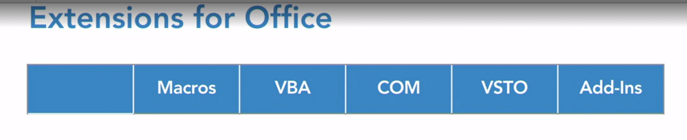
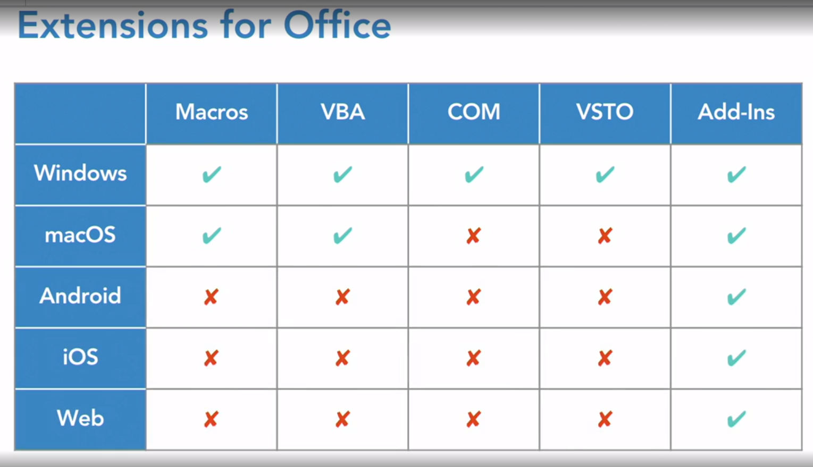
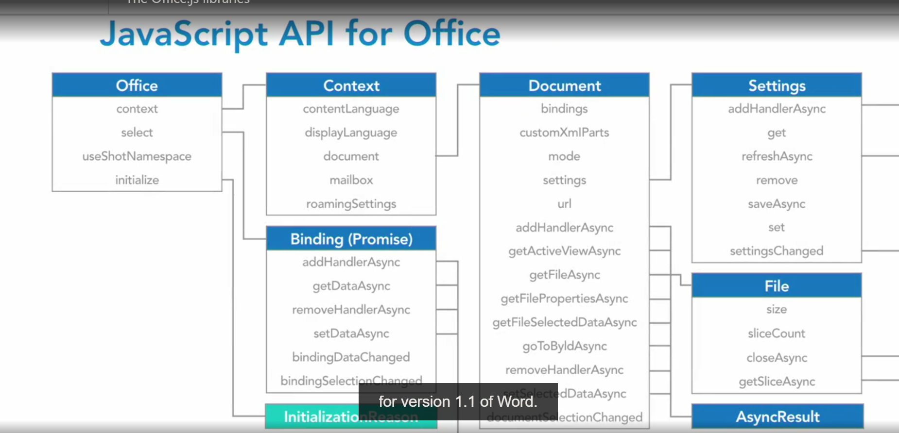
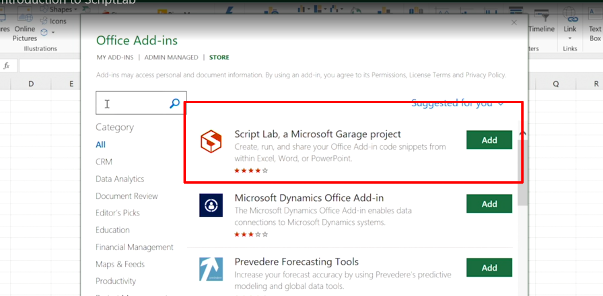
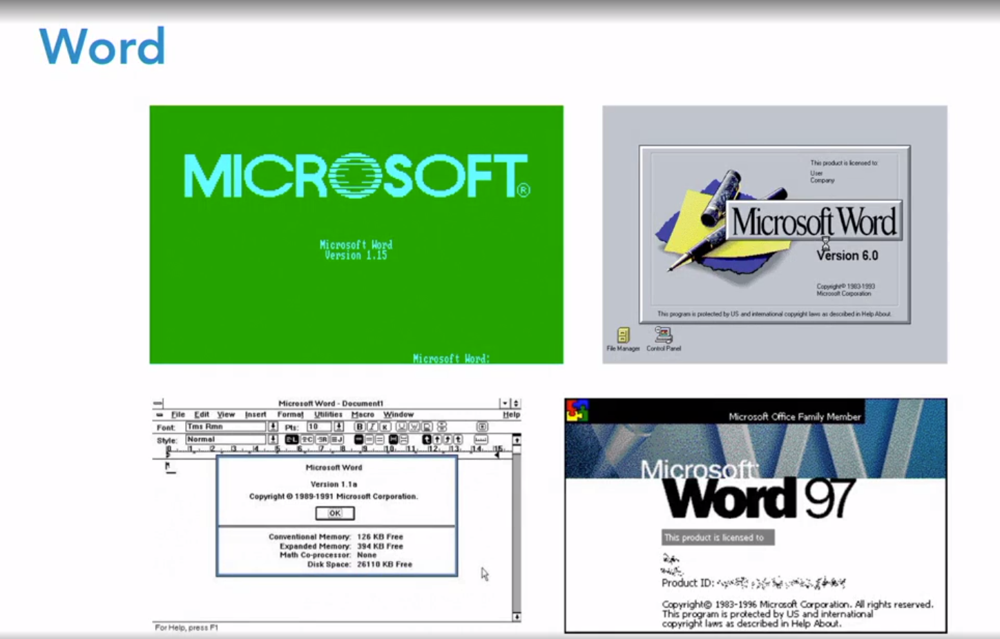
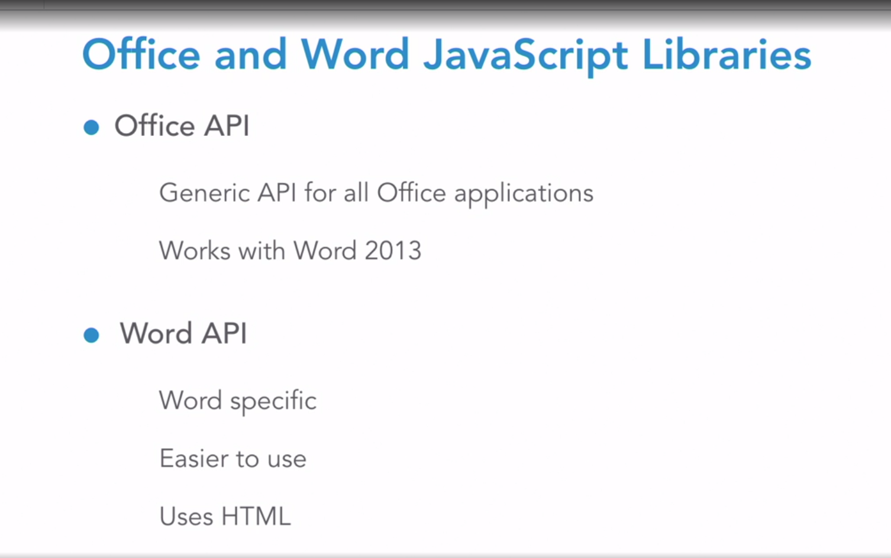
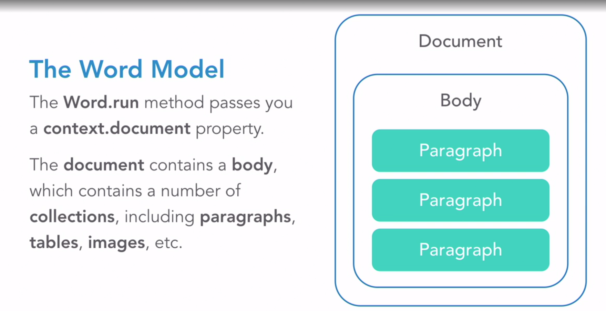
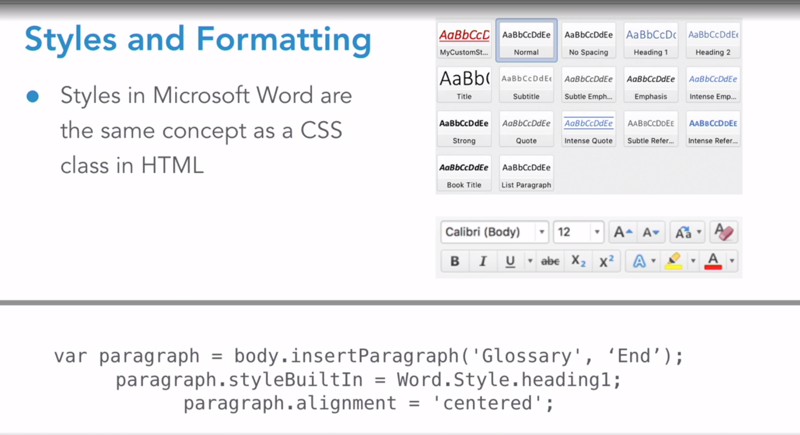
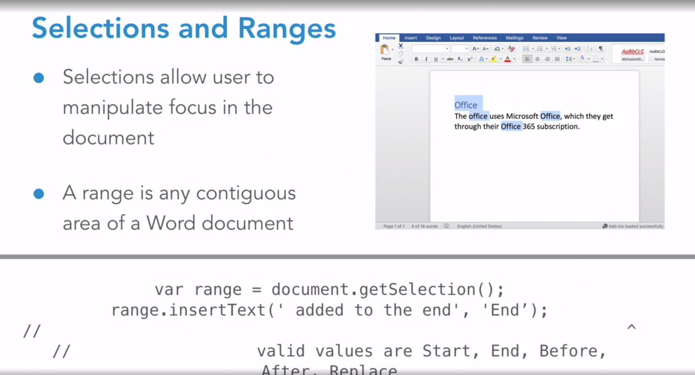

# office addin
* let you extend office applications 
* office already has millions of users  
- [office global docs](https://developer.microsoft.com/en-us/office)    
- [office doc](https://docs.microsoft.com/en-us/office/dev/add-ins)
* using tools like:
    * js, ts
    * react
    * angular
* this is different than VSTO (Visual Studio Tools for Office)

# plugin creation
* use yeoman to create the microsoft plugin
```shell
npm install -g yo generator-office
yo office
```

start the server and plugin
```shell
npm start
```

# extensions
   
   
   
 ## macros
 ## VBA
 ## COM
 ## VSTO
 ## Add-Ins

 * as you could see, wordadin is the one with more support in every platform

  ### tools for word add ins
  * web development tools
  * js support
  * any web technology is supported
    * ruby on rails
    * php
    * java ...
  * add-ins are manifest that point to webpages
  

# office.js
* access to body, attachments
* launch native forms (reply, new message)
* change fields
* custom properties

# entry points
why we need them?:
- checking the right support
- checking if the tab exists for us
- bindings
- prompt for some settings

how is it?
- Office.initialize
- Office.onReady

```javascript
Office.initialize = () => {
    Office.context.mailbox.item.body.getAsync(function(result) {
        console.log(result.value);
    });
} 

Office.onReady(() => {
    Office.context.mailbox.item.body.setAsync('hello world');
})
```

# office.initialize vs office.onReady
- office.initialize is just a function that is called when the addin is loaded, is it is called just once
    - is not the best use, but is still supported
    - you could define just one

- office.onReady is called when the addin is ready to be used, is it called every time the addin is loaded
    - you could define multiple onReady functions

# office.onReady

- callback way
```typescript
Office.onReady((info) => {
  if (info.host === Office.HostType.Word) {
    document.getElementById("sideload-msg").style.display = "none";
    document.getElementById("app-body").style.display = "flex";
    document.getElementById("run").onclick = run;
  }
});
```

- promise approach
```typescript
Office.onReady().then(function (info) {
  if (info.host === Office.HostType.Word) {
    // todo
  }
});
```

- async approach
```typescript
Office.onReady(async (info) => {
  if (info.host === Office.HostType.Word) {
    // todo
  }
});
```

- you could use both of then, Office.onReady and Office.initialize, having in mind that for Office.initialize, you could define just one function

```typescript
Office.initialize = (reason) => {
    document.getElementById("username").innerHTML = "dmolina";
}
```

# check api support
- let you check if the current office application support the specific api

```typescript
if(!Office.context.requirements.isSetSupported("ExcelApi", 1.7)){
  document.getElementById("username").innerHTML = "Excel API 1.7 is not supported by your version of Office.";
}else{
  document.getElementById("username").innerHTML = "the api is there";
}
```


# Office common steps
1. onReady
2. check api support
3. get context and load properties
4. sync context
5. get result

```typescript
Word.run((context)=>{
  context.load("currentUser", "roles");
  return context.sync().then(()=>{

  });
})
```

  

# Script lab
- bunch of examples to work with office.js
- let you run on real time office.js snippets
  


# excel
- runner entry point for excel
```typescript
Excel.run(async (context) => {
  await paintCells(context)
  await fillCellsWithValues(context)
})
```

## painting cells
```typescript
const paintCells = async (context: Excel.RequestContext) => {
  const range = context.workbook.getSelectedRange();
  range.format.fill.color = "red";
  await context.sync();
}
```

## fill values in columns
```typescript
const fillCellsWithValues = async (context: Excel.RequestContext) => {
    const sheet = context.workbook.worksheets.getActiveWorksheet();   
    sheet.getCell(2,2).values = [["daniel"]];
    await context.sync();
}
```


# manifest
[official doc](https://docs.microsoft.com/en-us/office/dev/add-ins/develop/add-in-manifests?tabs=tabid-1)  
## Hosts
```xml
  <Hosts>
    <Host Name="Workbook"/>
  </Hosts>
```

```xml
<Hosts>
      <Host xsi:type="Workbook">
        <DesktopFormFactor>
          <GetStarted>
            <Title resid="GetStarted.Title"/>
            <Description resid="GetStarted.Description"/>
            <LearnMoreUrl resid="GetStarted.LearnMoreUrl"/>
          </GetStarted>
          <FunctionFile resid="Commands.Url"/>
          <ExtensionPoint xsi:type="PrimaryCommandSurface">
            <OfficeTab id="TabHome">
              <Group id="CommandsGroup">
                <Label resid="CommandsGroup.Label"/>
                <Icon>
                  <bt:Image size="16" resid="Icon.16x16"/>
                  <bt:Image size="32" resid="Icon.32x32"/>
                  <bt:Image size="80" resid="Icon.80x80"/>
                </Icon>
                <Control xsi:type="Button" id="TaskpaneButton">
                  <Label resid="TaskpaneButton.Label"/>
                  <Supertip>
                    <Title resid="TaskpaneButton.Label"/>
                    <Description resid="TaskpaneButton.Tooltip"/>
                  </Supertip>
                  <Icon>
                    <bt:Image size="16" resid="Icon.16x16"/>
                    <bt:Image size="32" resid="Icon.32x32"/>
                    <bt:Image size="80" resid="Icon.80x80"/>
                  </Icon>
                  <Action xsi:type="ShowTaskpane">
                    <TaskpaneId>ButtonId1</TaskpaneId>
                    <SourceLocation resid="Taskpane.Url"/>
                  </Action>
                </Control>
              </Group>
            </OfficeTab>
          </ExtensionPoint>
        </DesktopFormFactor>
      </Host>
    </Hosts>
    
```
### conclusions
you need to define hosts, multiple times, in case you need the add-in working in each office application.

# fabric ui
# fluent ui
offer several flavors:
- web
- react
- ios, android, windows, cross

# fluentui installation
# example with dialog
[official documentation](https://docs.microsoft.com/en-us/fluent-ui/web-components/components/dialog)
- contains a bunch of example for each ui component:
  - dialogs
  - buttons
  - menu
  - listbox

```shell
npm install --save @fluentui/web-components
```


```typescript
import {
  provideFluentDesignSystem,
  fluentDialog, 
  fluentButton,
} from "@fluentui/web-components";

provideFluentDesignSystem().register(fluentButton(), fluentDialog());

let dialogElement;
dialogElement = document.getElementById('defaultDialog');

export async function runOnclick() {
  try {
    await Excel.run(async (context) => {
      dialogElement.hidden = false;
    }
  }
}
```


```html
  <h2>Dialog</h2>
  <fluent-button appearance="accent" id="dialogOpener">Show Dialog</fluent-button>
  <fluent-dialog id="defaultDialog" hidden trap-focus modal>
    <div style="margin: 20px">
      <h2>Dialog with text and a button</h2>
      <fluent-button id="dialogCloser" appearance="accent" tabindex="0">Dismiss</fluent-button>
    </div>
  </fluent-dialog>
```

# word
[official documentation](https://docs.microsoft.com/en-us/office/dev/add-ins/tutorials/word-tutorial?view=excel-js-preview)

# excel
[official documentation](https://docs.microsoft.com/en-us/office/dev/add-ins/tutorials/excel-tutorial?view=excel-js-preview)

# add-in commands
custom office ui ribbon, tabs, context menus and menu controls  

# command actions
- ShowTaskPane:
  - show a taskpane in the ui

- ExecuteFunction
  - execute a function
    - you need to declare these functions in commands.ts

# debugging
package.json
```json
  "config": {
    "app_to_debug": "word",
    "app_type_to_debug": "desktop",
    "dev_server_port": 3000
  },
```

# buttons with functions
[official doc](https://docs.microsoft.com/en-us/javascript/api/manifest/functionfile?view=common-js-preview)

define the function to be executed
```typescript
export async function paintData(event){
  try {
    await Excel.run(async (context) => {
      const range = context.workbook.getSelectedRange();
      range.load("address");
      range.format.fill.color = "yellow";
      await context.sync();
      console.log(`The range address was ${range.address}.`);
      event.completed();
    });
  } catch (error) {
    console.error(error);
  }
}

Office.onReady(async (info) => {
  Office.actions.associate("paintData", paintData);
});

```

declare the action
```xml
<Action xsi:type="ExecuteFunction">
                      <FunctionName>paintData</FunctionName>
                    </Action>
```

connect the action with the commands file
```xml
          <FunctionFile resid="Commands.Url"/>
```

# loading add-in
1. loading localhost
[browser](https://localhost:3000/home.html)

2. from web 365
3. from local word app


```javascript
module.exports = async (env, options) => {
  const dev = options.mode === "development";
  const config = {
    devtool: "source-map",
    entry: {
      polyfill: ["core-js/stable", "regenerator-runtime/runtime"],
      taskpane: "./src/taskpane/home.ts",
```

```typescript
declare var Office;
```


### conclusions
- is important to declare the .ts file along side .html file.
- declare var when you can't import the library, and still you need to use it.

```shell
npm i ajv@latest 
```
### conclusions
- reinstall per project to avoid specific version issue

# Angular with office add in
1. yo office
2. select angular
3. to create an angular component, you need to associated the .ts file in webpack.config file
4. add the component to the module declaration
5. then call office api directly from the component
> angular is loaded after Office.OnReady

```shell
yo office 
```

# React with office add in
1. yo office
2. select react
3. Create your component
  - import and put the tag in your App.tsx without any additional config
4. again, the app get's render once office is loaded


# fluent ui react
[docs](https://developer.microsoft.com/en-us/fluentui)  

- fluent ui has a dedicated section for react, they already have a bunch of components to work with react


```typescriptreact
  import { Icon } from '@fluentui/react/lib/Icon';
```

```typescriptreact
  const MyIcon = () => <Icon iconName="CompassNW" />;
```

```typescriptreact
  <button onClick={onClick}>
      <MyIcon />
      click me
  </button>
```

# Design guidelines
[doc](https://docs.microsoft.com/en-us/office/dev/add-ins/design/add-in-design)
- do just one thing
- keep consistency with office
- adapt to several devices, touch and so on.
  -  Context.touchEnabled 

# word api
is older than windows, comes from 1983
  
  

# Office API
support everything, lot of boilerplate code

# Word API
simpler, but does not support word 2013

# Word model
  
1. Word.run returns a context
2. context contains a document
3. document contains paragraphs, images and so on

```javascript
Word.run(async (context) => {
  const paragraph = context.document.body.insertParagraph("Hello World", Word.InsertLocation.end);
  paragraph.font.color = "blue";
  await context.sync();
});
```

# Word styling
  

# ECMA format
.zip file who compress xml manifest and files that represent word document
let you convert between native and ECMA and vice versa
- this is how office online works

# Selections and ranges
  

# Images
they use base64 to store the image data